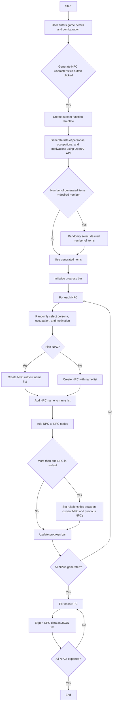

# NPC Generator

This project is an NPC (Non-Player Character) generator for creating diverse and unique characters for a game world. It uses the OpenAI API to generate character details, relationships, and interactions based on user-defined game settings, moods, and desired feelings.

## Features

- Generate unique lists of personas, occupations, and motivations for NPCs based on the game's setting, mood, and desired feelings.
- Create a specified number of NPCs with diverse characteristics and backgrounds.
- Generate character sheets for each NPC, including their name, TLDR, speech pattern, motivation, and character attributes.
- Establish relationships between NPCs based on their character sheets and context.
- Export generated NPCs as JSON files for easy integration into game projects.

## Requirements

- Python 3.x
- Streamlit
- OpenAI API key

## Installation

1. Clone the repository:

```bash
git clone https://github.com/your-username/npc-generator.git
cd npc-generator
```

2. Install the required dependencies:

```bash
pip install -r requirements.txt
```

3. Set up your OpenAI API key:

Create a file named `.secrets` in the project directory and paste your OpenAI API key inside.

## Usage

1. Run the Streamlit app:

```bash
streamlit run app.py
```

2. Access the NPC Generator Configuration page in your web browser.

3. Enter the game setting, mood, desired feelings, and any additional notes or storyboard details.

4. Adjust the configuration sliders to set the diversity of occupations, motivations, and character traits, as well as the number of NPCs to generate.

5. Click the "Generate NPC Characteristics" button to generate the NPCs.

6. The generated NPCs will be displayed on the page, along with their names, TLDRs, and character sheets.

7. The NPC data will be exported as JSON files in the `characters` directory.

## Code Structure

- `app.py`: The main Streamlit app for configuring and generating NPCs.
- `npc.py`: The NPC class for generating character details, managing relationships, and exporting NPC data.

## Flowchart


---
## Simpler explanation:

1. User Input:
   - The user enters the game details such as the setting, mood, desired feelings, and any additional notes or storyboard details.
   - The user adjusts the configuration sliders to set the diversity of occupations, motivations, character traits, and the number of NPCs to generate.

2. Generating NPC Characteristics:
   - When the user clicks the "Generate NPC Characteristics" button, the algorithm starts.
   - It creates a custom function template based on the user's input for the number of personas, occupations, and motivating entities.

3. Generating Lists:
   - The algorithm sends a request to the OpenAI API to generate lists of unique personas, occupations, and motivations based on the game details provided by the user.
   - If the number of generated items in each list is greater than the desired number specified by the user, the algorithm randomly selects the desired number of items from each list.

4. Creating NPCs:
   - The algorithm initializes a progress bar to track the generation of NPCs.
   - For each NPC, the algorithm does the following:
     - Randomly selects a persona, occupation, and motivation from the generated lists.
     - If it's the first NPC, it creates the NPC without a name list. Otherwise, it creates the NPC with the existing name list.
     - Adds the NPC's name to the name list and the NPC object to the list of NPC nodes.

5. Setting Relationships:
   - If there is more than one NPC in the list of NPC nodes, the algorithm sets the relationships between the current NPC and the previously generated NPCs.
   - It does this by calling the `set_relation` method of the NPC class, which analyzes the character sheets of the two NPCs and determines their relationship based on the provided context.

6. Updating Progress:
   - After each NPC is generated, the algorithm updates the progress bar to show the progress of NPC generation.

7. Exporting NPCs:
   - Once all the NPCs are generated, the algorithm iterates over each NPC in the list of NPC nodes.
   - For each NPC, it calls the `export_npc` method of the NPC class, which exports the NPC's data as a JSON file in the specified output directory.

8. Displaying Results:
   - The generated NPCs are displayed on the Streamlit app page, showing their names, TLDRs (short summaries), and character sheets.

9. Termination:
   - After all the NPCs are exported, the algorithm ends.
